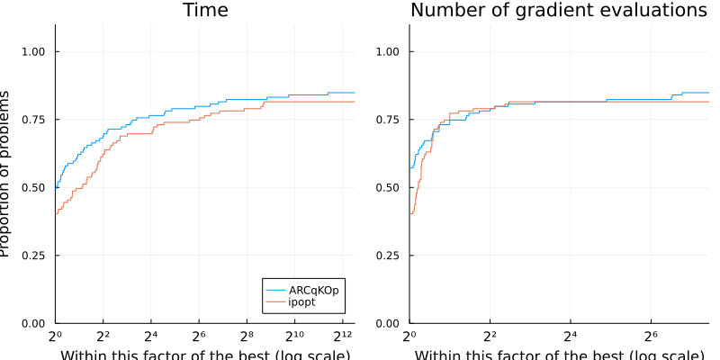

# Summary

`ARCTR.jl` is a new Julia [@bezanson2017julia] implementation of trust-region and adaptive regularization with cubics (ARC) for solving the unconstrained nonlinear optimization problem
\begin{equation}\label{eq:nlp}
    \underset{x \in \mathbb{R}^n}{\text{minimize}} \quad f(x),
\end{equation}
where  $f:\mathbb{R}^n \rightarrow \mathbb{R}$ is twice continuously differentiable.
Adaptive Cubic Regularization (ARC) algorithms, recently explored by Cartis et al. [@cartis-gould-toint-2011a] [@cartis-gould-toint-2011b] are closely related to trust region (TR) methods [@conn-gould-toint-2000] in that steps are computed by solving a sequence of regularized subproblems. A major theoretical appeal of ARC over TR methods is their optimal worst-case complexity property. Whereas the number of function evaluations required to reach a point x for which $\|\nabla f(x)\| \leq \epsilon$ is $O(\epsilon^{-2})$ for TR, which is no better than steepest descent [@CARTIS201293], that number is $O(\epsilon^{-3/2})$ for ARC. This package exploits the common point in the algorithm of both approaches to provide a unified implementation that can then be specialized as described in [@dussault-2019].

By default, we implemented the scalable ARC described in [@dussault2021scalable] in which a set of shifted systems is solved concurrently by way of an appropriate modification of the Lanczos formulation of the conjugate gradient (CG) method.
We also implemented classical Steihaug-Toint approach with a standard non shifted conjugate gradient algorithm that is interrupted either when reaching the boundary of the trust region or when satisfying the required accuracy [@conn-gould-toint-2000].
One of the significant advantages of these two implementations is that the algorithm can be used factorization-free, i.e., it uses second-order information via Hessian-vector products but does not need access to the Hessian as an explicit matrix. In this case, the subproblem can be solved using iterative methods for linear algebra from `Krylov.jl` [@montoison-orban-krylov-2020], which provides more than 30 implementations of standard and novel Krylov methods, and they all can be used with Nvidia GPU via CUDA.jl [@besard2018juliagpu]. This makes `ARCTR.jl` a valuable asset for large-scale problems. 
As described in the package documentation, it is also possible to implement new ARC/TR variants by specialiazing a set of functions. For instance, The modularity of the package could allow to solve the subproblems using the sparse factorization of a symmetric matrix via `LDLFactorizations.jl` [@orban-ldlfactorizations-2020], or the well-known Fortran code `MA57` [@duff-2004] from the @HSL, via `HSL.jl` [@orban-hsl-2021].

`ARCTR.jl` is built upon the JuliaSmoothOptimizers (JSO) tools [@jso]. JSO is an academic organization containing a collection of Julia packages for nonlinear optimization software development, testing, and benchmarking. It provides tools for building models, accessing problems repositories, and solving subproblems. `ARCTR.jl` takes as input an `AbstractNLPModel`, JSO's general model API defined in `NLPModels.jl` [@orban-siqueira-nlpmodels-2020], a flexible data type to evaluate objective and constraints, their derivatives, and to provide any information that a solver might request from a model. The user can hand-code derivatives, use automatic differentiation, or use JSO-interfaces to classical mathematical optimization modeling languages such as AMPL [@fourer2003ampl], CUTEst [@cutest], or JuMP [@jump]. 

# Statement of need

Julia's JIT compiler is attractive for the design of efficient scientific computing software, and, in particular, mathematical optimization [@lubin2015computing], and has become a natural choice for developing new solvers.

There already exist ways to solve \eqref{eq:nlp} in Julia.
If \eqref{eq:nlp} is amenable to being modeled in `JuMP` [@jump], the model may be passed to state-of-the-art solvers, implemented in low-level compiled languages, via wrappers thanks to Julia's native interoperability with such languages.
However, interfaces to low-level languages have limitations that pure Julia implementations do not have, including the ability to apply solvers with various arithmetic types.

`Optim.jl` [@mogensen2018optim] implements a factorization-based pure Julia trust-region method.
`Manopt.jl` [@Bergmann2022] implements a trust-region method using Steihaug-Toint truncated conjugate-gradient method to solve the trust-region subproblems.
`JSOSolvers.jl` [@orban-siqueira-jsosolvers-2021] contains a collection of unconstrained optimization solvers coded in Julia. In particular, `trunk` is a factorization-free trust-region method described in [@conn-gould-toint-2000].
Even though, it has a superior worst-case complexity behavior, to the best of our knowledge, there is no available maintained open-source implementation of ARC methods.

`ARCTR.jl` can solve large-scale problems and can be benchmarked easily against other JSO-compliant solvers using `SolverBenchmark.jl` [@orban-siqueira-solverbenchmark-2020].
We include below performance profiles [@dolan2002benchmarking] of `ARCTR.jl` against `Ipopt` on 119 unconstrained problems from CUTEst [@cutest] between 100 and 192,627 variables.
Ipopt solved 97 problems (76%) successfully, which is four less than ARCqK.
Without explaining performance profiles in full detail, the plot on the left shows that Ipopt is the fastest on 43 of the problems (40%), while ARCqK is the fastest on 58 of the problems (50%) among the 71 problems solved by both solvers. The plot on the right shows that Ipopt used fewer evaluations of gradient functions on 40 of the problems (40%), ARCqK used fewer evaluations on 51 of the problems (60%).
Overall, this performance profile is very encouraging for such a young implementation.
This implementation is in particular interesting for numerical optimization as it shows improved behavior compared to trust-region methods of adaptive regularization with cubics.

<!--
illustrating that `ARCTR` is a fast and stable alternative to a state of the art solver

NOTE: Putting the code is too long
```
include("make_problems_list.jl") # setup a file `list_problems.dat` with problem names
include("benchmark.jl") # run the benchmark and store the result in `ipopt_dcildl_82.jld2`
include("figures.jl") # make the figure
```
-->

{ width=100% }

# Acknowledgements

Jean-Pierre Dussault and Dominique Orban are partially supported by NSERC Discovery Grants, and 
Tangi Migot is supported by IVADO and the Canada First Research Excellence Fund / Apogée.

# References
